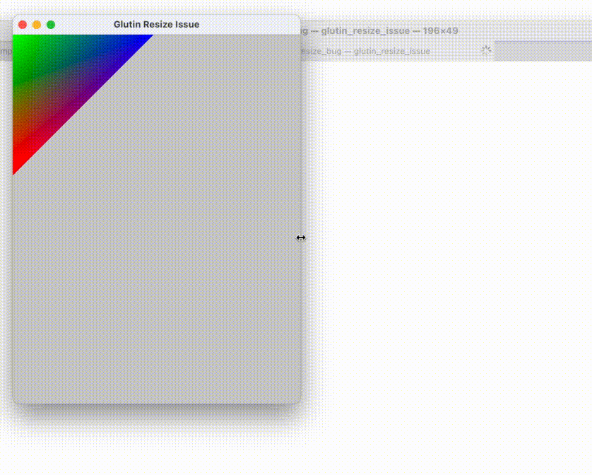

Demonstrates the issue with window resize being handled asynchronously (?).

Running:

```
cargo run
```

Expected: the triangle is of fixed size, sticking to the top left corner

Actual:



Environment:

- macOS 11.0.1 (20B29)
- MacBook Pro (15-inch, 2019) w/ Radeon Pro 560X 4 GB
- External 4k@120Hz display: issue visible more often
- Internal MacBook display: less often, still reproduceable

It seems that macOS has to draw resized window before OpenGL had a chance to provide an updated frame. Lacking the frame, it decides to resize what it has: the old frame. That’s why triangle changes size. After rendering catches up, a frame is rendered of the correct size, and triangle is back at its original size.